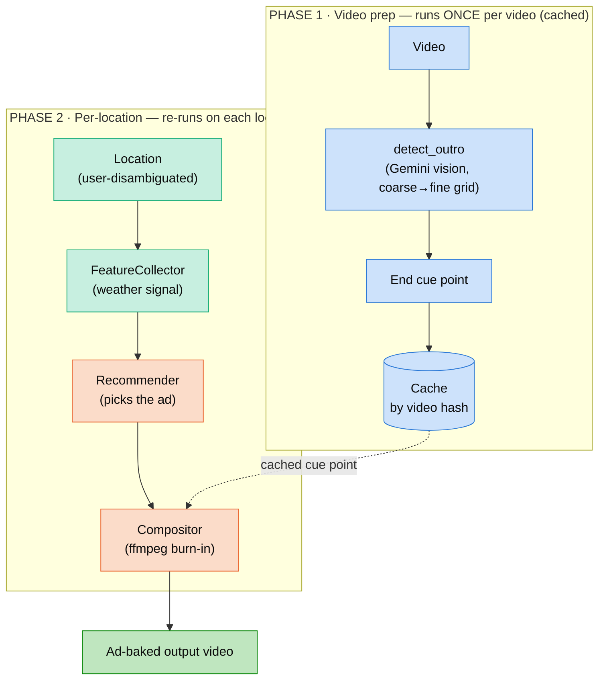

# Brahma AI — Weather-Aware End Cue Point Ad Insertion

An **agentic system** that takes a video and a location, figures out where the
video's **end cue point (outro / end credits)** begins, checks the **current
weather** at that location, and **burns a weather-appropriate ad** full-screen
into the end cue point:

| Weather | Ad shown    |
|---------|-------------|
| ☔ Rainy | Umbrella ad |
| ☀️ Sunny | Sunscreen ad |

A minimalistic Streamlit UI takes the two inputs and shows the **original** and
the **ad-baked** video side by side, with the reasoning behind the decision.

## 🎥 Demo

- ▶️ **[Walkthrough / UI demo](Demo%20Video.mp4)** — `Demo Video.mp4` (repo root).
- ▶️ **[Sample output](outputs/Demo%20Output.mp4)** — `outputs/Demo Output.mp4`,
  a rendered result with the ad burned into the end cue point.

GitHub streams these inline when the file is opened. To embed one as an inline
autoplaying player on the repo page, drag it into the GitHub README editor and
paste the resulting `https://github.com/user-attachments/...` URL here.

---

## Architecture & rationale

### The core decision: a structured pipeline with LLM reasoning at the decision points — not a free-running agent

The task is a **known, finite workflow** — detect the cue point → read weather →
pick an ad → burn it in. It is a directed graph, not an open-ended goal. So
rather than a fully autonomous ReAct / tool-calling loop that decides its own
next step, I built a **deterministic orchestrator** (`agent/orchestrator.py`) that
inserts LLM reasoning **only at the two points where judgment genuinely beats
rules** (visual cue-point detection and ad recommendation), plus one
human-in-the-loop point (location disambiguation).

**Why this over a full agent loop:**

- **Determinism & testability** — the control flow is plain code, so it is
  reproducible and unit-tested; only the "smart leaves" are probabilistic.
- **Cost & latency** — a loop re-invoking an LLM to orchestrate ffmpeg/weather
  calls adds tokens and wall-clock with no accuracy gain on a fixed DAG.
- **Failure isolation** — non-determinism is contained to two well-guarded calls
  with structured output and fallbacks, instead of spread across the whole run.
- **The autonomy dial still exists** — the recommender's `strategy: llm` runs the
  decision fully on Gemini, and `agent.enabled` toggles LLM vs. deterministic. I
  built the *seam* for more autonomy without paying for it on every run.

### Patterns used, and why

| Pattern | Where | Rationale |
|---|---|---|
| **Orchestrator / coordinator–worker** | `orchestrator.py` | A deterministic conductor delegates to smart collaborators; control flow stays testable. |
| **Sense → Plan → Act** | collector → recommender → compositor | The classic agent loop, unrolled into explicit, cacheable phases instead of an LLM-driven `while`. |
| **LLM-as-perception (vision grounding)** | `detect_outro` | Grounds a fuzzy visual concept ("where do credits start?") that classical CV handles brittlely; generalizes across outro styles without per-video tuning. |
| **Coarse → fine (hierarchical refinement)** | `detect_outro` | Two-pass grid (10s → 1s) bounds vision-token cost while keeping timestamp precision. |
| **Feature-store / blackboard** | `features/` | Weather is *one* `FeatureProvider`; the recommender reasons over whatever `FeatureSet` arrives, so new signals (geo, time, trend, DB, tool) plug in via config without touching callers. This is the main extensibility seam. |
| **Strategy + graceful degradation** | `recommender.py` | `rule` / `llm` strategies chosen per experiment; the LLM path falls back to the deterministic rule on any error, so a demo never dead-ends. |
| **Structured / constrained output** | both LLM calls | Every model call returns typed JSON (`{image_index, confidence}`, `{ad_id, reason}`), making the LLM↔system boundary a schema, not free text. |
| **Guardrail / safety-constrained decision** | `detect_outro` | The **never-early guarantee**: the prompt biases late, code never subtracts, the fine pass corrects early picks, and any failure appends the ad at the end. A domain safety rule the model cannot override. |
| **Human-in-the-loop** | location disambiguation | Ambiguous places surface candidates for the user to pick (Bangalore India vs. Pakistan) rather than a silent guess. |
| **Explainability / reasoning trace** | `_build_reasoning` | Every run emits *why* an ad was chosen — auditability for a recommendation system. |
| **Memoization / idempotency** | detection + composite caches | The expensive vision step runs once per video (keyed by content hash); composites cache per `(video, ad)`. |

### Cross-cutting choices

- **Config-driven** — models, thresholds, ad catalog, prompts, and the
  autonomy/ strategy switches all live in `config.yaml` + editable prompt files;
  behaviour changes without code edits.
- **Vertex AI via a service account** — "keys, not values": only the credential
  *structure* is committed (`bq_creds.example.json`), never secrets.
- **Two-phase split** — cue-point detection is a property of the *video*, ad
  selection of the *location*; separating them means changing location re-runs
  only the cheap steps.

---

## 1. What was built

### The pipeline (two phases)



End-cue-point detection is a property of the **video**, not the location, so it
runs once and is cached — changing the location only re-runs the cheap
weather → recommend → composite steps.

### It's a recommendation system, not an `if weather == rainy` switch

Ad selection is deliberately modelled as a **recommender over features**, because
in the real world many signals decide an ad — not just weather:

- **Feature layer** (`src/brahma/features/`) — each signal is a `FeatureProvider`
  behind a common interface, declared in `config.yaml`. Today there is one
  (`weather`); adding *time-of-day*, *geo-demographics*, *trending*, *user
  profile*, or a *DB/tool-sourced* feature is a two-line change (register the
  provider + enable it in config). The `FeatureCollector` runs all enabled
  providers in parallel and hands a `FeatureSet` to the recommender.
- **Recommender** (`src/brahma/recommender/`) — fixed per experiment via config
  (`strategy: rule | llm`, `experiment_id`). Ads carry metadata tags, so the
  recommender matches signals→ads generically. Because there is currently a
  single feature, the default `rule` strategy is a transparent tag-match; the
  same interface scales to a learned/LLM model over many features without
  touching any caller.

### The "agentic" intelligence lives in three judgment points

1. **End-cue-point detection** — Gemini vision reads sampled frames and decides
   where the ending starts (robust to different outro styles: rolling credits,
   montage recaps, sponsor cards, closing titles).
2. **Location understanding** — free-text locations are geocoded to explicit
   candidates the **user disambiguates** (never a silent guess — see below).
3. **Explained decision** — every run produces a human-readable rationale
   ("Weather in Mumbai is rainy → umbrella ad; end cue point at 9:20…").

### Location disambiguation (never guess a city)

Ambiguous names are not resolved blindly. `geocode_candidates()` returns the top
matches (with country/region) and the UI makes the **user pick** — so
"Bangalore" no longer silently becomes *Bangalore Town, Pakistan*. Because
Open-Meteo's geocoder is name-exact, a small config-driven **alias map**
(`weather.geocode_aliases`: Bangalore→Bengaluru, Bombay→Mumbai, Calcutta→Kolkata,
Madras→Chennai) is also searched and merged so renamed cities still appear as
options. The chosen candidate's exact coordinate is used downstream, so the
weather is fetched for precisely the place the user selected.

### Credentials gate

On load the UI validates the Vertex service account (file exists → valid JSON →
required fields present). If it is missing or malformed, a **fill-in panel** lets
the user upload or paste a service-account JSON before proceeding, instead of the
pipeline failing deep inside a run. `validate_credentials(ping=True)` can also
make a tiny live call to confirm the Vertex AI API is enabled and the key works.

### End-cue-point detection: Gemini-first, CV as evaluation

Credits realistically never exceed ~5 minutes, so we scan only a bounded tail
window and let **Gemini** decide, in two passes:

1. **Coarse** — sample the window every `coarse_step_sec` (10s), ask which frame
   first shows the end cue point.
2. **Fine** — resample every `fine_step_sec` (1s) around the coarse pick for a
   precise boundary.

**Never-early guarantee.** Showing the ad over real content is unacceptable;
starting a second *into* the credits is invisible. The detector is biased to be
**late, never early**: it reports the first frame that *clearly* shows the end
cue point (so the true start is at or before it), never subtracts time, and a
configurable `ad_start_delay_sec` (default **2s**) adds further safe margin.

**No end cue point is a valid answer.** Many videos (screen recordings, raw
clips, tutorials, demos) simply end with no ending sequence. The prompt tells the
model this explicitly and instructs it to return "none" when unsure rather than
guess — a fabricated cue point would burn the ad over real content. When none is
found, `has_outro` is `False` and the ad is **appended at the very end** of the
video instead of overlaid. The UI calls this out ("No end cue point found — ad
appended at the end"). The compositor also tolerates a **silent base video** (a
screen recording may have no audio track) by synthesising silence.

Classical CV (ffmpeg `blackdetect` + PySceneDetect) is **not** in the request
path — it lives in an **offline evaluation harness** (`scripts/eval_outro.py`)
that measures the Gemini detector's **signed error** against reference boundaries
or hand-labelled ground truth. On the bundled sample, ground truth is 559.5s and
the detector returns ~560.6s → **+1.1s (safely late)**, confidence 0.95.

### Compositing (ffmpeg)

- The ad plays **full-screen** starting `ad_start_delay_sec` into the end cue
  point, with **its own audio**, letterboxed to the video's resolution.
- **Short ad** (ends before the video does) → crossfade back to the remaining
  credits, restoring their original audio.
- **Long ad** (would overrun the end) → let it **play to completion**; the output
  simply extends past the original end.
- Output is **cached** by `(video hash, ad id)`, so flipping between a rainy and a
  sunny location reuses already-rendered files.

---

## 2. Project layout

```
app/streamlit_app.py          UI (side-by-side original vs. ad-baked)
src/brahma/
  agent/orchestrator.py       coordinates the 3 phases → PipelineResult
  features/                   FeatureProvider interface, weather provider, collector
  recommender/                fixed-model recommender (rule | llm)
  services/
    weather_api.py            Open-Meteo geocode + forecast → sunny/rainy
    outro_detection.py        Gemini coarse→fine detector (cached)
    compositor.py             ffmpeg full-screen burn-in
    media_utils.py            ffprobe/ffmpeg helpers + video hashing
  clients/gemini.py           Gemini via Vertex AI (service-account auth)
  config.py                   typed config loader (config.yaml + .env)
  models.py                   Pydantic DTOs
  exceptions.py               central exception hierarchy
configs/
  config.yaml                 ALL tunables (models, thresholds, ad catalog, paths)
  bq_creds.example.json       service-account template (structure to fill in)
  prompts/*.txt               editable LLM prompts
scripts/eval_outro.py         offline detector evaluation (CV as reference)
tests/                        pytest suite (90% coverage)
```

---

## 3. How to run

### Prerequisites
- Python ≥ 3.9, **ffmpeg** on PATH (`brew install ffmpeg` / `apt install ffmpeg`).
- A **GCP service account** with the **Vertex AI API enabled**, placed at
  `configs/bq_creds.json` (the project reads `project_id` from it).

### Auth — keys, not values
This project authenticates Gemini through **Vertex AI** using a service-account
file. **No secret values are committed** — only the structure to fill in:
- `configs/bq_creds.example.json` — the exact service-account JSON structure with
  placeholder hints for each field. **Copy it to `configs/bq_creds.json` and fill
  in your values.**
- `.env.example` — the env var names.

```bash
cp .env.example .env                              # then adjust if needed
cp configs/bq_creds.example.json configs/bq_creds.json
# fill configs/bq_creds.json with your GCP service-account values (gitignored)
```

### Local (venv + pip)
```bash
make setup     # create .venv and install deps
make run       # launch the Streamlit UI (http://localhost:8501)
```
Then: pick the sample video (Phase 1 detects the end cue point once), type a
location (e.g. **London** or **Mumbai** → umbrella; **Phoenix** → sunscreen), and
click **Generate**.

### Docker (ffmpeg bundled)
```bash
make docker-build
make docker-run    # mounts configs/, adv_video/, sample_video/, outputs/
```

### Dev toolchain
```bash
make format    # black + ruff --fix
make lint      # ruff + mypy --strict
make test      # pytest + coverage
make all       # format + lint + test
```

### Evaluate the end-cue-point detector
```bash
.venv/bin/python scripts/eval_outro.py "sample_video/<file>.mp4" --truth 559.5
```

---

## 4. Configuration

Everything tunable is in `configs/config.yaml` — no code edits needed to change
behaviour:

- **Models**: `gemini.orchestrator_model`, `gemini.vision_model`, `gemini.location`.
- **Weather**: Open-Meteo endpoints, the WMO codes counted as `rainy`.
- **Features**: declare/enable signal providers (`features:` list).
- **Recommender**: `strategy` (`rule`/`llm`), `experiment_id`.
- **Ad catalog**: `ads:` with per-ad `tags` the recommender matches.
- **End cue point** (`outro:` block): lookback window, coarse/fine grid steps,
  `safety_bias_sec`.
- **Compositor**: `ad_start_delay_sec` (the configurable delay, default 2s),
  fade duration, codecs, CRF.
- **Agent**: `agent.enabled: false` forces the deterministic (LLM-free) path.

Prompts are editable text files under `configs/prompts/` (end-cue-point styles
vary — the prompt is intentionally not one-size-fits-all).

---

## 5. Assumptions & limitations

- **Credits length**: we assume the end cue point (outro/credits) realistically
  never exceeds **~5 minutes**, so detection only scans that bounded tail window
  (`outro.max_outro_lookback_sec`, default 300s) instead of the whole video —
  cheaper and, for typical content, more accurate.
- **Media geometry**: for simplicity the sample video and both ads share the same
  resolution (720p) and frame rate (sample 25 fps; ads 720p). The compositor
  still normalises the ad to the base video's geometry/fps/timebase, but it does
  not adapt to the *viewer's* playback resolution. See *Future work*.
- **Weather buckets**: reduced to `sunny`/`rainy` as specified.
- **Single feature**: only `weather` is wired today; the framework is built to
  take many more (see below).
- Vertex AI must be enabled on the credentials' project, and end-cue-point
  detection uses vision tokens on the first run per video (cached thereafter).

---

## 6. Future work (What I thought can be done within the scope)

- **Match the viewer's watching resolution & frame rate.** Today all media share
  720p and we assume a match. A production version would detect the viewer's
  playback resolution/fps and transcode/rescale the ad to match before burn-in
  (and pick the best-fitting ad rendition), avoiding letterboxing and re-encode
  artefacts.
- **A richer recommendation model.** With a single feature (weather) a
  deterministic tag-mapping is enough, **but the feature-provider + recommender
  framework is deliberately modular and extensible** to accommodate more complex,
  near-real-time models with many input features — geo-demographics, time of day,
  trending topics, user profile, and features sourced from a DB or tool calls —
  without changing any caller. Swapping in a learned/LLM ranker is a config change
  (`recommender.strategy`, `experiment_id`).
- **Faster compositing.** Today the whole video is re-encoded (~50s for a 10-min
  clip). Since everything before the ad is unchanged, a production version would
  **stream-copy the untouched head** and re-encode only the short ad+fade region,
  then concatenate — cutting this to a few seconds — plus a faster/hardware
  encoder preset. (Prototyped, but reverted for reliability across arbitrary
  input codecs; needs more testing before shipping.)
- **More weather/ad classes** and multi-ad rotations.
- **Region overlay** (ad in a corner/band over live credits) as an alternative to
  full-screen.
- **Batch mode / API** in addition to the interactive UI, and cloud deployment.
- **Larger end-cue-point eval set** with labelled ground truth to track detector
  precision/recall and the never-early property across many videos.
